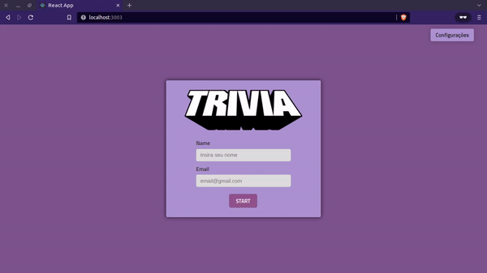

# Projeto Trivia

  ## 📷 Screenshot
  

## 📋 Descrição do projeto

Um projeto de front end, que pega e trata os dados de uma API e renderiza em modo de um jogo. Este foi um projeto em grupo, realizado dentro da trybe. 

## 💻 Tecnologias utilizadas
- React
- Redux
- JavaScript
- CSS

## 🚀 Links

- Site em produção: [Link](https://dogl4.github.io/trivia/index.html) 

##  :inbox_tray: Para rodar este projeto
- Para baixar este projeto via git rode no terminal: `git clone git@github.com:Dogl4/trivia.git` ou baixe .zipado [aqui](https://github.com/Dogl4/trivia/archive/refs/heads/main.zip)
- No terminal, na pasta raiz, rode o comando: `npm install` e depois `npm start`
 
## 📈 Status do projeto

✅ Concluído

## Colaboradores

Estas pessoas participaram deste projeto:

<table>
  <tr  style="width:120px">
    <td align="center">
      <a  target=”_blank”  href="https://github.com/Dogl4">
       
    
      <b>Pedro Barreto</b>
    
      </a>
     </td>
    <td  align="center">
      <a  target=”_blank”  href="https://github.com/andreallherrera">
        
        
          <b>Andrea Herrera</b>
        
      </a>
    </td>
    <td  align="center">
      <a  target=”_blank”  href="https://github.com/hectoreddbenitez">
         
        
          <b>Héctor Benitez</b>
        
      </a>
        <td  align="center">
      <a  target=”_blank”  href="https://github.com/JoaoVFerreira">
         
        
          <b>João Ferreira</b>
        
      </a>
    </td>
     <td  align="center">
      <a  target=”_blank”  href="https://github.com/yalves8">
         
        
          <b>Yasmin Alves</b>
        
      </a>
    </td>
     <td  align="center">
      <a  target=”_blank”  href="https://github.com/BeatrizSilva43">
         
        
          <b>Beatriz Bianca</b>
        
      </a>
    </td>
    <td  align="center">
      <a  target=”_blank”  href="https://github.com/betrybe">
         
        
          <b>Trybe</b>
        
      </a>
    </td>
</tr>
</table>

